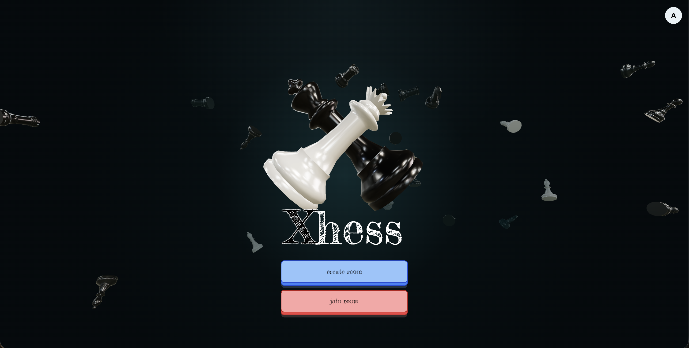
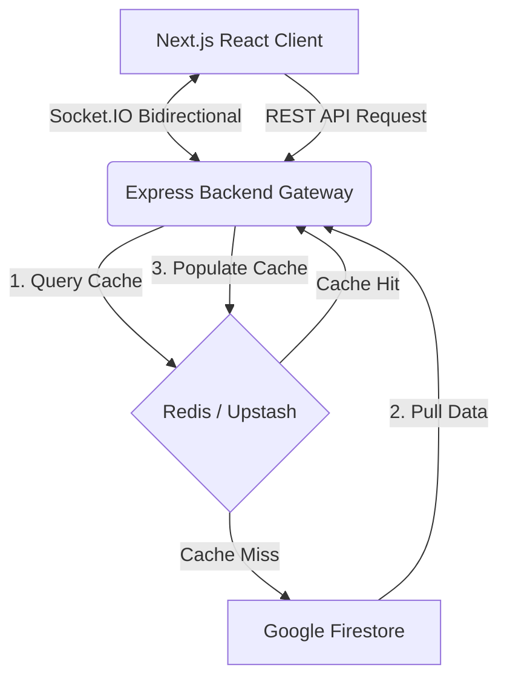

<div align="center">
  
  
  

# XHESS

[](https://nextjs.org/)
[](https://github.com/pmndrs/react-three-fiber)
[](https://www.typescriptlang.org/)
[](https://expressjs.com/)
[](https://socket.io/)
[](https://redis.io/)
[](https://firebase.google.com/)
[](https://www.docker.com/)

  <p align="center">
    <a href="#-key-features">Key Features</a> •
    <a href="#-system-architecture">Architecture</a> •
    <a href="#-custom-chess-engine">Rules Engine</a> •
    <a href="#-monorepo-layout">Monorepo Layout</a> •
    <a href="#-getting-started">Getting Started</a>
  </p>
</div>

---

## 🌟 Overview

**Xhess** is a professional, high-performance real-time multiplayer chess platform. Built as a modern, monorepo Proof of Concept (POC), it demonstrates robust system-design strategies, real-time WebSocket synchronization, and a custom cache-aside pipeline designed to handle high-traffic gaming workloads smoothly and cost-effectively.

---

## 🚀 Key Features

*   **🎮 Stunning 3D WebGL Interface:** Custom 3D chess pieces rendered smoothly in the browser using **React Three Fiber (R3F)** and **Three.js**, featuring interactive controls, studio lighting, a 3D Side Selector, and elegant hand-drawn themes.
*   **🔌 Real-Time Multiplayer Gateway:** Low-latency bidirectional gameplay, turn clocks, draw negotiations, surrenders, and instant live messaging powered by **Socket.IO** rooms.
*   **⚡ Smart Caching Pipeline (Cache-Aside):** Dual-layer database that buffers active games and profiles in **Redis** (local TCP / Upstash serverless HTTP) before committing to a durable **Google Firestore** store, cutting database costs and latency.
*   **🛡️ Robust Gateway Security:** Active sessions are secured using **Firebase Auth** ID Token checks server-side, with full transport-level input validation powered by **Zod** schemas.
*   **🔗 Shared Type-Safe Monorepo:** Structured using npm Workspaces to share types, Zod schemas, and game utils seamlessly between Next.js frontend and Express backend.

---

## 🏗️ System Architecture

Xhess decouples client interactions, real-time socket events, cache lookups, and global database updates:



### 🏎️ Simple Cache-Aside Pattern
1.  **Read:** Check **Redis** first. On hit, return in under a millisecond. On miss, load from **Firestore**, cache in Redis (60m TTL), and respond.
2.  **Write:** Write directly to **Firestore**, then instantly overwrite or invalidate the **Redis** cache to prevent stale reads.

---

## 🧩 Custom Chess Engine

Xhess features a custom-built, purely mathematical chess validator under `@xhess/shared/utils/rules/` that runs without relying on heavy third-party chess libraries:

*   **Strategy Pattern Design:** Each piece (Pawn, Rook, Knight, Bishop, Queen, King) has an isolated movement strategy, implementing a clean common interface.
*   **Mathematical Pin & Check Detection:** Instantly predicts checks using a virtual simulator (`willMoveCheck()`) that calculates coordinate threat matrices before path execution.
*   **Complete Chess Support:** Fully handles double-steps, castling paths, en passant captures, checkmate checks, and stalemate conditions.

---

## 📂 Monorepo Layout

Xhess is organized as an **npm Workspaces monorepo**, strictly dividing architectural layers while preserving full compilation-time type safety:

### 1. Common Library (`shared/`)
Contains the single source of truth for the entire application, eliminating duplicate code:
*   `src/constants/`: Basic grid parameters, coordinates, and directional movement vectors.
*   `src/schemas/`: Universal **Zod schemas** that validate authentication tokens, profile details, room creations, and chess moves.
*   `src/types/`: Centralized TypeScript interfaces for game states, chess pieces, boards, and socket message structures.
*   `src/utils/rules/`: The complete strategy-pattern chess movement calculator, checkmate evaluator, and check detector.

### 2. Backend Gateway API Server (`server/`)
A stateless, secure Express backend built to scale horizontally:
*   `src/config/`: Secure loader setups for environment variables, Firebase Admin, and Socket servers.
*   `src/controllers/`: Endpoint handlers and database routers implementing **Zod parsing** on entry.
*   `src/databases/`: Multi-client setup linking local Redis, Upstash serverless Redis, and Firestore instances.
*   `src/middleware/`: Global middleware for Firebase Session Auth, rate limiting, and Helmet headers.
*   `src/services/`: Central business controllers handling user profiles, room configurations, and real-time game logs.
*   `src/utils/`: High-performance WebSocket event handlers and boundary safety guards.

### 3. Frontend Client Application (`web/`)
A responsive, high-fidelity Next.js 15 client built for immersive gameplay:
*   `src/app/`: App router layouts, route mappings, and dedicated dynamic multiplayer room views.
*   `src/components/`: Reusable components including standard 2D boards, modal structures, and complex **React Three Fiber (R3F) WebGL canvases** (e.g. settings selection and background backdrops).
*   `src/lib/`: Custom helpers loading Fredericka The Great typography, material colors, and Firebase Client setups.
*   `src/redux/`: Global UI state stores utilizing Redux Toolkit slices (controlling boards, chat streams, and modal actions).
*   `src/services/`: Client-side Socket.IO wrappers and REST API communication layers.

---

## ⚙️ Getting Started

### 1. Configure Environments
Create a `.env` file in both `server/` and `web/` directories:

**Backend (`server/.env`)**
```env
PORT=8000
FIREBASE_PROJECT_ID=your-project-id
FIREBASE_CLIENT_EMAIL=your-service-account-email
FIREBASE_PRIVATE_KEY="your-private-key"
REDIS_URL=redis://localhost:6379
```

**Frontend (`web/.env`)**
```env
NEXT_PUBLIC_BACKEND_URL=http://localhost:8000
```

### 2. Run Redis
```bash
docker run --name xhess-redis -p 6379:6379 -d redis:7-alpine
```

### 3. Start Development Natively
```bash
npm install
npm run server-dev  # Runs Express Backend
npm run web-dev     # Runs Next.js Frontend
```

### 4. Run via Docker Compose
```bash
docker-compose up --build
```
